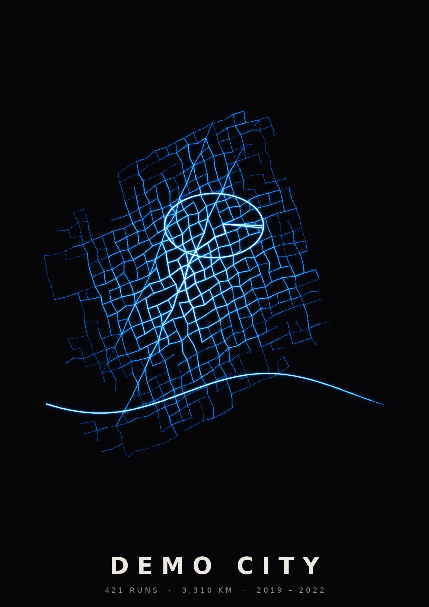

# Run Heatmap

A web page that shows every run you've ever done on one glowing map.

Drop in the export you downloaded from Strava, Garmin or another service, and
every route is drawn on top of the others. Streets you ran once show as a
faint trace, and the ones you run every week glow brightest, like a long
exposure photo of your running life. Frame the part you like and download it
as a print-ready poster.

<p align="center">
  
  
  
</p>

<sub>These previews use made-up runs.</sub>

## The idea

- **Your files never leave your computer.** The whole app runs in the
  visitor's browser. The server only sends the page, and nothing is uploaded.
  That means there's no account and no privacy policy to worry about.
- **No server code.** This repository *is* the website: plain HTML, CSS and
  JavaScript. There's no PHP, no database, no build step and nothing to
  install. Any web server that can serve files will do.
- **Nothing loaded from elsewhere.** The map library (Leaflet) and the unzip
  library (fflate) are in `vendor/`. The only outside requests are for the
  street map tiles (see [API keys](#street-map-api-keys) below).

## What visitors can do

1. **Add runs.** Drop a folder or `.zip` onto the page, or use the buttons.
   GPX, TCX and FIT files work, gzipped or not. Strava and Garmin export zips
   work as downloaded, including Garmin's zips inside zips. Strava's
   `activities.csv` is used to tell runs from rides.
2. **Filter.** Choose runs, rides, walks or everything, and a date range.
   "Hide start & finish" removes the first and last stretch of every route,
   so a shared poster doesn't show where you live.
3. **Style the map.** Pick the street map, line colour and glow.
4. **Make a poster.** Move the map to frame it (the dashed rectangle shows
   the poster), choose the paper size, colours and quality, and download a
   PNG. Sizes run from A4 to A1 and 24 × 36 in, at up to 300 dpi.

### Where people get their GPS files

| Service | How to export |
|---|---|
| **Strava** | Settings → My Account → *Download or Delete Your Account* → *Request your archive*. Drop in the `.zip`. |
| **Garmin Connect** | Account settings → *Data Management* → *Export Your Data*. Drop in the `.zip` as it is. |
| **Apple Health** | Health app → profile picture → *Export All Health Data*. Unzip it and drop in `apple_health_export/workout-routes`. |
| **Others** (Coros, Polar, Suunto, …) | Any GPX, TCX or FIT files work. |

## Putting it on a web server

Clone the repository straight into your web server's document folder:

```sh
cd /path/to/htdocs            # or /var/www/html, etc.
git clone https://github.com/woodyjeffay/heatmap.git heatmap
```

Then open `http://localhost/heatmap/` (or `https://your-domain/heatmap/`).
To update later, run `git pull` inside that folder.

It has to come from a web server. Double-clicking `index.html` won't work,
because browsers only run this kind of page (JavaScript modules) when it
comes from a server. To test without Apache, run this in the folder and
open http://localhost:8000:

```sh
python3 -m http.server 8000
```

## Street map API keys

The routes are drawn over a dark street map, and that map comes from a
tile service. **Since 23 September 2026, CARTO's maps (the default) need a
free API key.** Without one, every map tile just says "API KEY REQUIRED".
Your routes and posters still work, just without the streets underneath.

1. Get a free key at [carto.com/basemaps/apikey](https://carto.com/basemaps/apikey/).
2. Paste it into [`config.js`](config.js):

   ```js
   mapKeys: {
     carto: "paste-your-carto-key-here",
     stadia: "",
     maptiler: "",
   },
   ```

3. Reload the page. Every visitor now gets the street map without needing a
   key of their own.

Things to know:

- **The key is public either way.** The browser has to download `config.js`
  to use the key, so anyone who looks at the page's files can see it. That's
  normal for map keys. If CARTO lets you restrict the key to your website's
  address, do that, so others can't use up your quota.
- **Think twice before committing it.** If this repository is public and
  you commit `config.js` with your key, the key is on GitHub too. You can
  edit `config.js` only on the server, and run
  `git update-index --skip-worktree config.js` there so `git pull` and
  `git status` leave your edit alone.
- **Visitors can use their own key.** If `config.js` has no key, the page
  asks for one in step 3. A visitor's key is saved only in their own browser
  and overrides the site's key.

Other maps you can choose in the page (set the default with `defaultMap` in
`config.js`):

| Map | Key |
|---|---|
| CARTO dark / light *(default)* | Free key from [carto.com](https://carto.com/basemaps/apikey/). |
| Stadia dark | None on `localhost`. On a public site, add your domain (or get a key) at [stadiamaps.com](https://stadiamaps.com). |
| MapTiler dark | Free key from [maptiler.com](https://cloud.maptiler.com/account/keys/). |
| None | No street map, just the glowing runs on black. No key needed. |

## Files

```
index.html        the page
config.js         map API keys and the default map (edit this one)
css/app.css
js/
├── app.js        page wiring
├── parse.js      GPX / TCX / FIT / zip / Strava csv reading
├── geo.js        map projection and framing
├── map.js        the interactive glowing map
└── heat.js       poster rendering
vendor/           Leaflet (maps) and fflate (unzipping)
docs/             README images
```

## How it works

1. **Parse.** GPX, TCX and FIT files are read into lists of latitude and
   longitude points. Where the GPS jumps a long way (signal loss, or a pause
   and move), the line is split so no straight jumps cross the map.
2. **Project.** Points use Web Mercator, the same projection as web maps,
   so the routes line up with the street map.
3. **Accumulate.** Each run is drawn once and added to a counter, so every
   pixel counts how many runs passed through it. Running the same loop three
   times in one run counts once.
4. **Tone map.** Counts become brightness on a log scale, so a route you ran
   once stays visible next to one you ran hundreds of times.
5. **Glow and colour.** Blurred copies of the lines make the halo, and the
   brightness picks a colour from the palette.

## Browser notes

- Works in current Chrome, Edge, Firefox and Safari.
- Big posters use a lot of memory. A2 at 300 dpi is about 35 million pixels.
  On phones and iPads, Safari may refuse sizes that large, and the page will
  ask for a lower quality.
- Very large exports (several GB) work best added as an unzipped folder.

## History

This started as a Python command-line tool, which was removed when the
website became the product. It's still in the git history, before the commit
that moved the website to the top level.
